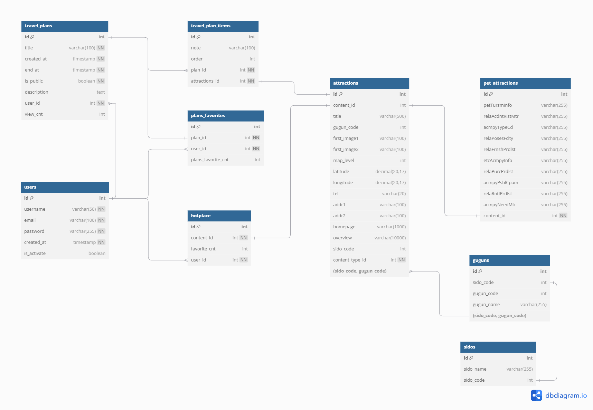

# README.md

날짜: 2024년 10월 18일

## 프로젝트 목표

반려견과 함께 편안하게 여행할 수 있는 관광지 추천

## 활용 API

[NAVER CLOUD PLATFORM](https://www.ncloud.com/product/applicationService/maps)

지도 API

[ODsay LAB](https://lab.odsay.com/guide/guide#guideWeb_2)

대중교통API

[한국관광공사_국문 관광정보 서비스_GW](https://www.data.go.kr/tcs/dss/selectApiDataDetailView.do?publicDataPk=15101578)

- 반려동물 동반 여행 정보
- 공통정보조회
- 소개정보조회
- 반복정보조회
- 이미지정보조회

## 필수 기능

### 기능 1 : 계획 짜기 - 최단 거리

1. 제목 : 최단 거리 알고리즘 적용
2. 내용 : 다익스트라를 이용한 최단 거리 서비스
3. 적용 알고리즘 : 다익스트라
4. 알고리즘 개요
    1. 출발지와 도착지 설정
    2. 각 탭에서 자차, 버스, 기차, 지하철을 이용했을 때 걸리는 시간 확인 가능
    3. 모든 교통 수단 중에서 최단 시간 및 비용을 고려한 최적 경로를 추천
5. 적용 서비스 : 길 찾기
    
    ```json
    {
        "result": {
            "searchType": 0,
            "pointDistance": 5000.0,
            "path": [
                {
                    "pathType": 1,
                    "info": {
                        "trafficDistance": 12000.0,
                        "totalWalk": 500,
                        "totalTime": 50,
                        "payment": 1000,
                        "busTransitCount": 0,
                        "subwayTransitCount": 1
                    },
                    "subPath": [
                        {
                            "trafficType": 1,
                            "distance": 8000.0,
                            "sectionTime": 30,
                            "stationCount": 10
                        }
                    ]
                },
                {
                    "pathType": 2,
                    "info": {
                        "trafficDistance": 15000.0,
                        "totalWalk": 1000,
                        "totalTime": 60,
                        "payment": 1200,
                        "busTransitCount": 1,
                        "subwayTransitCount": 0
                    },
                    "subPath": [
                        {
                            "trafficType": 2,
                            "distance": 10000.0,
                            "sectionTime": 40,
                            "stationCount": 5
                        }
                    ]
                },
                {
                    "pathType": 3,
                    "info": {
                        "trafficDistance": 18000.0,
                        "totalWalk": 800,
                        "totalTime": 70,
                        "payment": 1500,
                        "busTransitCount": 1,
                        "subwayTransitCount": 1
                    },
                    "subPath": [
                        {
                            "trafficType": 1,
                            "distance": 10000.0,
                            "sectionTime": 40,
                            "stationCount": 8
                        }
                    ]
                },
                {
                    "pathType": 4,
                    "info": {
                        "trafficDistance": 20000.0,
                        "totalWalk": 1200,
                        "totalTime": 80,
                        "payment": 1800,
                        "busTransitCount": 2,
                        "subwayTransitCount": 1
                    },
                    "subPath": [
                        {
                            "trafficType": 2,
                            "distance": 12000.0,
                            "sectionTime": 50,
                            "stationCount": 7
                        },
                        {
                            "trafficType": 1,
                            "distance": 8000.0,
                            "sectionTime": 30,
                            "stationCount": 5
                        }
                    ]
                }
            ]
        }
    }
    
    ```
    
    ```java
    package ForTest;
    
    import org.json.JSONArray;
    import org.json.JSONObject;
    import java.io.InputStream;
    import java.util.*;
    
    class Node {
        int id;
        double weight; // 가중치 (시간 + 비용)
    
        public Node(int id, double weight) {
            this.id = id;
            this.weight = weight;
        }
    }
    
    public class Main {
    
        public static void main(String[] args) {
            ClassLoader classLoader = Main.class.getClassLoader();
    
            // resources 폴더의 JSON 파일을 읽어옴
            try (InputStream inputStream = classLoader.getResourceAsStream("src/resources/test_dijkstra_transport_data.json")) {
                if (inputStream == null) {
                    System.out.println("파일을 찾을 수 없습니다.");
                    return;
                }
    
                // JSON 파일을 문자열로 읽어옴
                Scanner scanner = new Scanner(inputStream, "UTF-8");
                String jsonText = scanner.useDelimiter("\\A").next();
                scanner.close();
    
                // JSON 데이터를 파싱
                JSONObject jsonObject = new JSONObject(jsonText);
                JSONArray paths = jsonObject.getJSONObject("result").getJSONArray("path");
    
                // 2차원 그래프 초기화
                List<Node>[] graph = new ArrayList[paths.length()];
                for (int i = 0; i < paths.length(); i++) {
                    graph[i] = new ArrayList<>();
                    JSONObject pathInfo = paths.getJSONObject(i).getJSONObject("info");
    
                    int totalTime = pathInfo.getInt("totalTime");
                    int payment = pathInfo.getInt("payment");
                    int busTransitCount = pathInfo.getInt("busTransitCount");
                    int subwayTransitCount = pathInfo.getInt("subwayTransitCount");
    
                    // 가중치 계산 (시간 + 비용 + 환승 횟수에 대한 가중치 추가)
                    double weight = totalTime + payment + (busTransitCount + subwayTransitCount) * 10;
    
                    // 현재 경로에서 자기 자신으로의 가중치를 추가 (환승이 없는 경우)
                    graph[i].add(new Node(i, weight));
    
                    // 경로 간 연결 처리 (subPath 사용)
                    JSONArray subPath = paths.getJSONObject(i).getJSONArray("subPath");
                    for (int j = 0; j < subPath.length(); j++) {
                        JSONObject transitInfo = subPath.getJSONObject(j);
                        int sectionTime = transitInfo.getInt("sectionTime");
                        double distance = transitInfo.getDouble("distance");
    
                        // subPath를 통해 환승 구간을 노드로 연결
                        int nextNode = (i + 1) % paths.length(); // 예시로 다음 노드로 연결
    
                        // 환승 구간의 가중치를 계산하여 그래프에 추가
                        double transferWeight = sectionTime + distance;
                        graph[i].add(new Node(nextNode, transferWeight));
                    }
                }
    
                // 도착지 설정 (예시로 마지막 경로를 도착지로 설정)
                int destination = graph.length - 1; // 마지막 경로를 도착지로 설정
    
                // 다익스트라 알고리즘 실행 (출발지는 0, 도착지는 지정된 destination)
                Result result = dijkstra(graph, 0, 4);
    
                // 결과 출력
                if (result.dist[destination] != Double.MAX_VALUE) {
                    System.out.println("도착지(" + destination + ")까지의 최단 가중치: " + result.dist[destination]);
                    System.out.print("최단 경로: ");
                    printPath(result.prev, destination); // 최단 경로 출력
                } else {
                    System.out.println("도착지에 도달할 수 없습니다.");
                }
    
            } catch (Exception e) {
                e.printStackTrace();
            }
        }
    
        // 다익스트라 알고리즘 (도착지를 포함)
        private static Result dijkstra(List<Node>[] graph, int start, int destination) {
            double[] dist = new double[graph.length];
            int[] prev = new int[graph.length]; // 이전 노드 추적을 위한 배열
            Arrays.fill(dist, Double.MAX_VALUE); // 초기화
            Arrays.fill(prev, -1); // 이전 노드 초기화
            dist[start] = 0;
    
            PriorityQueue<Node> pq = new PriorityQueue<>(Comparator.comparingDouble(node -> node.weight));
            pq.add(new Node(start, 0));
    
            while (!pq.isEmpty()) {
                Node current = pq.poll();
    
                // 도착지에 도달하면 종료
                if (current.id == destination) {
                    break;
                }
    
                for (Node neighbor : graph[current.id]) {
                    double newDist = dist[current.id] + neighbor.weight;
    
                    if (newDist < dist[neighbor.id]) {
                        dist[neighbor.id] = newDist;
                        prev[neighbor.id] = current.id; // 이전 노드 기록
                        pq.add(new Node(neighbor.id, newDist));
                    }
                }
            }
            return new Result(dist, prev); // 거리와 이전 노드 배열 반환
        }
    
        // 최단 경로 출력 (이전 노드 배열을 이용해 역추적)
        private static void printPath(int[] prev, int node) {
            if (node == -1) return; // 경로가 없을 때
            printPath(prev, prev[node]); // 재귀적으로 이전 노드를 추적
            System.out.print(node + " ");
        }
    
        // 다익스트라 결과를 저장할 클래스
        private static class Result {
            double[] dist;
            int[] prev;
    
            public Result(double[] dist, int[] prev) {
                this.dist = dist;
                this.prev = prev;
            }
        }
    }
    
    ```
    
6. 적용 서비스 개발 개요 ( 1/2 페이지 분량으로 작성 )
    1. API를 통해 얻은 모든 경로들을 순회하기
    2. 데이터에서 `distance` 와 `totalTime` 을 뽑아내기
    3. 거리와 시간을 가중치로 평가하기
    4. 가장 낮은 가중치를 가지는 경로 선택하기
    5. 최적 경로 출력

### 기능 2 : 패턴 매칭 - 기타동반정보

1. 제목 : 패턴 매칭 알고리즘 적용
2. 내용 : 패턴 매칭을 결합한 결과 내 재검색 서비스
3. 적용 알고리즘 : KMP 알고리즘
4. 알고리즘 개요
    1. API를 통해 얻은 `etcAcmpyInfo`와 `acmpyPsblCpam` 에서 문자열 추출
    2. KMP 알고리즘을 통해 ‘소형견’, ‘중형견’, ‘대형견’ 단어를 확인함
5. 적용 서비스 : 관광지 정보 검색 (추가 검색 과정)
6. 적용 서비스 개발 개요 
    1. 데이터 수집 및 전처리 : 공공 데이터 포털의 OpenAPI를 통해 수집된 JSON 데이터를 파싱하고 테이블을 구성한다.
    2. 관광지 검색으로 나온 결과 데이터에 ‘소형견’, ‘중형견’, ‘대형견’의 추가 검색 버튼을 추가한다.
    3. KMP 알고리즘을 적용해 문자열 패턴 매칭 결과를 통해 동반 가능 여부를 판단한다.

## 추가 기능

### 추가 기능 1: 🔥핫플레이스 🥵 등록

1. 제목 : 반려견 동반 핫플레이스 선정 및 표시
2. 내용 : 사용자 참여형 ‘좋아요’ 시스템을 통한 핫플레이스 선정 및 메인 화면 카드뷰 표시 기능
3. 서비스 개요 : 사용자들이 검색 결과에 ‘좋아요’ 누르면 핫플레이스로 선정한 것으로 선택되어 메인 화면에 이를 시각화 시키는 것으로 진행 
4. 주요 기능 
    1. 관광지별 ‘좋아요’기능
    2. 메인 화면 카드뷰 형태의 핫플레이스 표시

### 추가 기능 2: 여행계획 게시판

1. 제목 : 반려견 동반 여행 계획 공유
2. 내용 : 반려견 동반 가능 관광지 정보를 기반으로 한 여행 계획 수립, 공유, 그리고 커뮤니티 상호작용 서비스 구현
3. 서비스 개요 : 사용자들이 자신의 여행 계획을 쉽게 공유할 수 있게 해주고, 다른 사용자들의 계획도 함께 확인함으로써 더 나은 여행 경험을 만들어갈 수 있도록 지원한다.
4. 주요 기능
    1. 여행 계획 게시판
        1. 작성된 여행 계획은 사용자의 선택에 따라 공개 게시판에 공유될 수 있다.
        2. 게시판은 인기순으로 정렬 옵션을 지정할 수 있다. 
    2. 댓글 기능을 통한 소통
        1. 각 여행 계획에 대해 다른 사용자들이 댓글을 달 수 있다.
    3. ‘좋아요’ 기능을 통한 인기 여행 계획 정렬
        1. 사용자들은 마음에 드는 계획에 ‘좋아요’를 표시할 수 있다.

### 추가 기능 3

1. 제목 : 반려견 동반 여행 계획 작성
2. 내용 : 사용자가 반려견 동반 여행을 계획할 수 있다. 작성된 계획은 자동으로 마이페이지에 저장되며, 사용자의 선택에 따라 여행 계획 게시판에 공유할 수 있다.
3. 서비스 개요 : 사용자들이 자신의 여행 계획을 쉽게 저장. 
4. 주요 기능
    1. 여행할 관광지 선택
        1. 여행 제목 이름
        2. 여행 기간 선택 (달력 인터페이스 제공)
        3. 경로 시각화
    2. 마이페이지 자동 저장
        1. 작성한 계획 마이페이지에 자동 업로드
    3. 여행 계획 게시판 공유 옵션 선택

## ER-다이어그램(예상)

