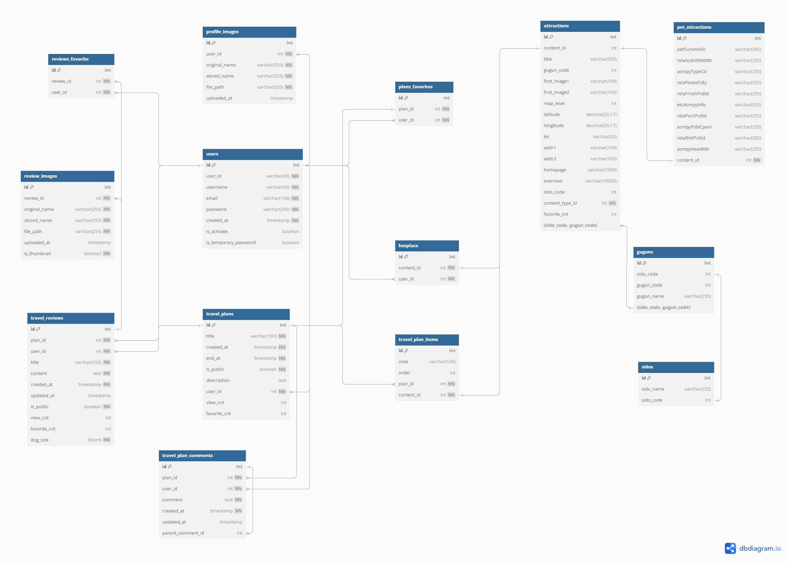
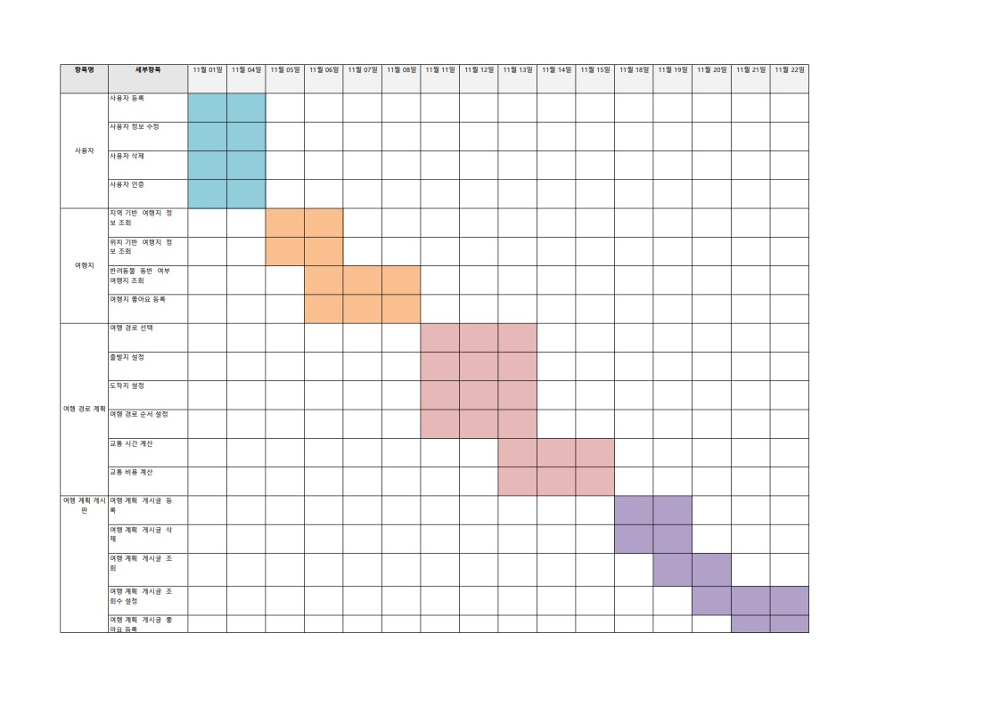
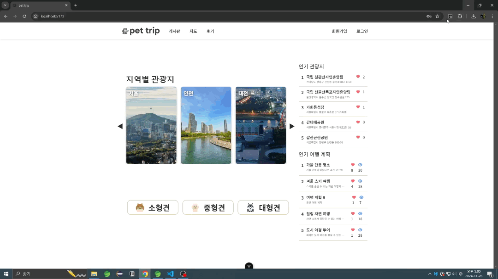
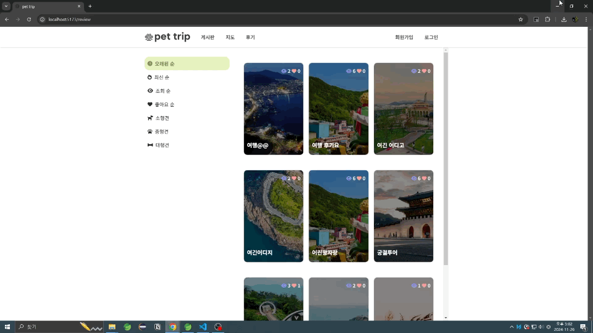

# README.md

날짜: 2024년 11월 26일

# 🐶 반려견 동반 관광지 정보 공유 사이트 🐶

<aside>
💡

-   반려견과 함께 방문할 수 있는 관광지를 검색
-   여행 계획과 후기를 공유
</aside>

## 내가 참여한 부분
- 지도 (프론트)
- 회원 등록 api 관련 일부 (백)
- 여행 경로 api 관련 일부 (백)
- 댓글 대댓글 (프론트, 백 일부)

## ✨ 프로젝트 개요

-   개발 환경
    -   Back : Spring, MyBatis
    -   Front : Vue.js, Bootstrap, Vuetify, Tailwind
    -   DB : MySQL
-   ERD 설계

    

-   업무 일정

    

-   UI 설계
    

## 💡 기능 구현

1. 메인 화면

    

    - 지역별 관광지 조회 → 지도로 전환
    - 반려견 크기로 입장 가능한 관광지 목록 조회 → 지도로 전환
    - 인기 관광지 목록 조회 → 지도로 전환
    - 인기 여행 계획 조회 → 상세보기로 전환

2. 회원 관리

    

    - 회원 가입
    - 로그인
    - 비밀번호 찾기 → 사용자 이메일로 임시 비밀번호 전송

3. 게시판 - 여행 계획

    

    - 정렬 조건으로 여행 계획 목록 조회
    - 여행 계획 상세 조회
    - (로그인 필수) 여행 계획 수정
    - (로그인 필수) 여행 계획 좋아요 등록 삭제
    - (로그인 필수) 여행 계획별 댓글 및 대댓글 작성 및 삭제

4. 지도

    

    - 타입 별 관광지 목록 조회 - 관광지 상세 정보 조회
    - 시도 - 구군 - 반려견 크기 별 관광지 조회
    - (로그인 필수) 관광지 목록으로 여행 계획 생성
        - 관광지 목록 드래그 앤 드랍으로 순서 변경 가능
        - 실시간 교통 시간 분석으로 총 소요시간과 택시비 확인 가능

5. 후기 - 여행 계획

    

    - 정렬 조건, 반려견 크기로 후기글 조회
    - 후기글 상세 조회
    - (로그인 필수) 후기글 좋아요 등록 삭제

6. (로그인 필수) 마이페이지

    

    - 비밀번호 입력 후 회원 정보, 프로필 이미지 변경 가능
    - 내가 만든 여행 계획, 좋아요 한 여행 계획, 저장한 여행 계획 목록 및 상세 조회
    - 저장한 여행 계획 별 후기 등록
